=====
django-spms
=====

django-spms是一个基于Django + AdminLTE的框架，集成了RBAC权限管理，账户管理，
JWT认证， 多站点统一登录CAS，基于DRF的API等模块，并集成第三方Celery，pycharts，
ckeditor，mdeditor模块，拥有清晰良好的代码结构，有助于快速的开启一个新的项目。

一、安装
-----------
1. 只支持Django 2.2.x, Python 3.6
2. 部署请参考 INSTALL
3. 实际示例截图见：demo目录

二、授权
-----------
BSD 3-Clause License

三、作者
-----------
spunkmars（spunkmars#gmail.com) http://github.com/spunkmars  http://www.spunkmars.com

四、项目目录结构
-----------
::

    src/
    ├── appxs # 子应用目录
    │   ├── account # 账户、权限子应用
    │   │   ├── fixtures # 测试数据集
    │   │   ├── forms # 表单
    │   │   ├── libs # 此子应用公用库
    │   │   ├── middleware # 中间件
    │   │   ├── models # 数据model
    │   │   ├── templates # 此子应用页面模板
    │   │   ├── templatetags # 此子应用页面模板标签
    │   │   ├── urls # url路由
    │   │   ├── utils # 工具
    │   │   └── views # 视图
    │   ├── api # DRF REST API
    │   │   ├── __init__.py
    │   │   ├── base
    │   │   │   ├── __init__.py
    │   │   │   ├── router.py
    │   │   │   ├── serializers.py
    │   │   │   └── views.py
    │   │   ├── libs # api 公共库
    │   │   ├── urls
    │   │   │   ├── __init__.py # api url路由配置
    │   │   └── versioned
    │   │       ├── __init__.py
    │   │       ├── v1 # 版本1 api接口
    │   │       └── v2 # 版本2 api接口
    │   ├── commonx # 公共服务子应用
    │   │   ├── forms
    │   │   ├── libs
    │   │   ├── models
    │   │   ├── signals
    │   │   ├── tasks
    │   │   ├── templates
    │   │   ├── templatetags
    │   │   ├── urls
    │   │   └── views
    │   └── quickstart # 示例子应用
    │       ├── fixtures
    │       ├── forms
    │       ├── models
    │       ├── signals
    │       ├── tasks
    │       ├── templates
    │       ├── templatetags
    │       ├── urls
    │       ├── utils
    │       └── views
    ├── bin # 管理、启动脚本
    ├── config # django应用配置
    │   ├── __init__.py
    │   ├── celery.py # celery 全局配置
    │   ├── options.py # 全局公用变量配置
    │   ├── settings
    │   │   ├── __init__.py
    │   │   ├── base.py # 公共setting配置
    │   │   ├── dev.py
    │   │   ├── local.py # 本地开发环境所需setting配置
    │   │   └── prod.py # 生产环境所需setting配置
    │   ├── urls.py # 全局 URL路由配置
    │   └── wsgi.py # wsgi 配置
    ├── data # 数据、配置
    │   ├── asset # 用户上传数据
    │   ├── conf # 应用配置
    │   ├── db # sqlite数据库存储路径
    │   ├── fixtures # 初始化数据
    │   ├── gunicorn # gunicorn配置
    │   ├── libdata # 自定义公共库所需数据文件
    │   ├── locale # 翻译文件
    │   │   ├── zh_CN
    │   │   └── zh_TW
    │   ├── nginx # nginx 相关配置
    │   ├── supervisor # supervisor 配置
    │   └── uwsgi # uwsgi 配置
    ├── libs # 公共库
    │   ├── utils # 公共库
    │   └── utils_3rd # 第三方公共库
    ├── requirements
    │   ├── base.txt # 公用python依赖
    │   ├── dev.txt
    │   ├── local.txt # 本地开发环境python依赖
    │   ├── prod.txt # 生产环境python依赖
    │   └── test.txt
    ├── requirements.txt # python依赖
    ├── resource # 对外网站静态资源
    │   ├── file
    │   └── static # collectstatic 生成的静态文件
    ├── runtime # 程序运行时数据
    │   ├── log # 程序运行日志
    │   ├── pid # 存储pid文件
    │   └── tmp # 临时文件
    ├── static # 静态资源目录
    │   ├── adminlte # adminlte前端框架路径
    │   └── common # 自定义公共资源目录
    │       ├── css
    │       ├── fonts
    │       ├── img
    │       └── js
    ├── templates # 页面模板目录
    │   ├── 403.html # 默认403页面
    │   ├── 404.html # 默认404页面
    │   ├── add_data.html
    │   ├── add_data2.html
    │   ├── add_data2_not_nav.html
    │   ├── base.html # 页面大框
    │   ├── blank.html
    │   ├── blank_box.html
    │   ├── bottom.html # 页面底部
    │   ├── edit_data.html
    │   ├── edit_data2.html
    │   ├── edit_data2_not_nav.html
    │   ├── index.html
    │   ├── list_data.html # 表格页面
    │   ├── list_data2.html
    │   ├── list_data3.html
    │   ├── location.html # 导航栏
    │   ├── main_nav.html # 头部菜单栏
    │   ├── main_nav_user_info.html # 头部菜单用户信息
    │   ├── mama_cas
    │   │   └── login.html
    │   ├── menu_tpl.html
    │   ├── popup_success.html
    │   ├── rest_framework
    │   │   ├── api.html
    │   │   └── login.html
    │   ├── sidebar_control.html # 右边栏页面控制
    │   └── sidebar_nav.html # 左边栏导航栏
    ├── templatetags # 页面模版tag
    ├── tests # 测试文件
    └── utils # 工具文件

五、DEMO截图
-----------
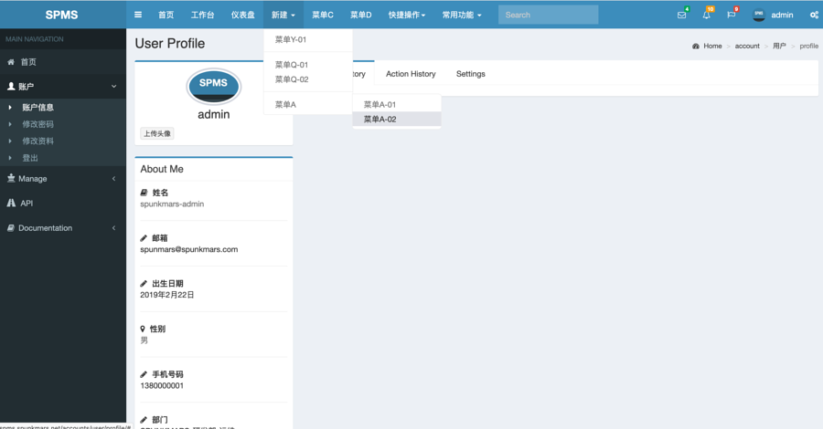

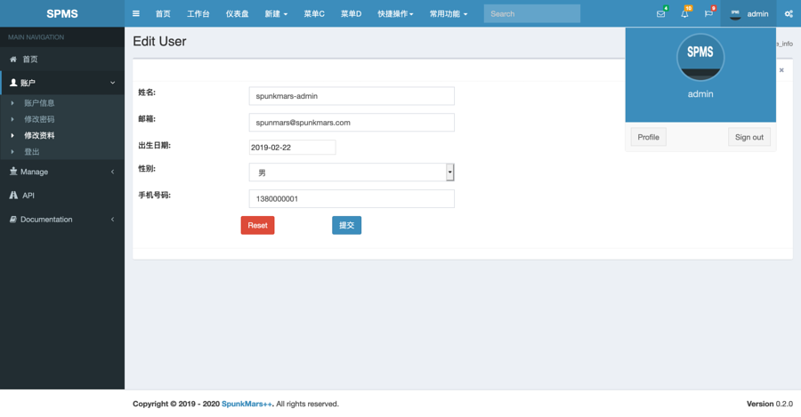

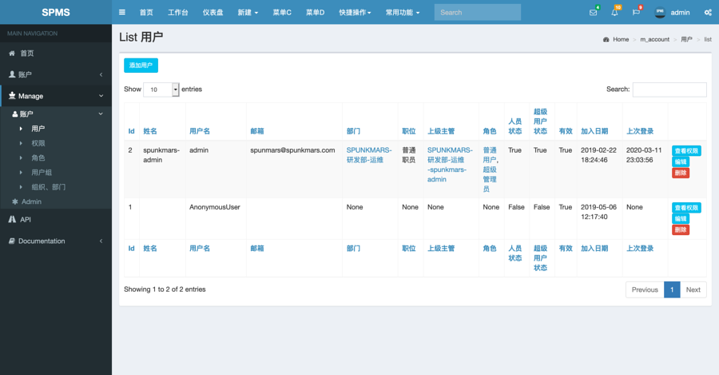

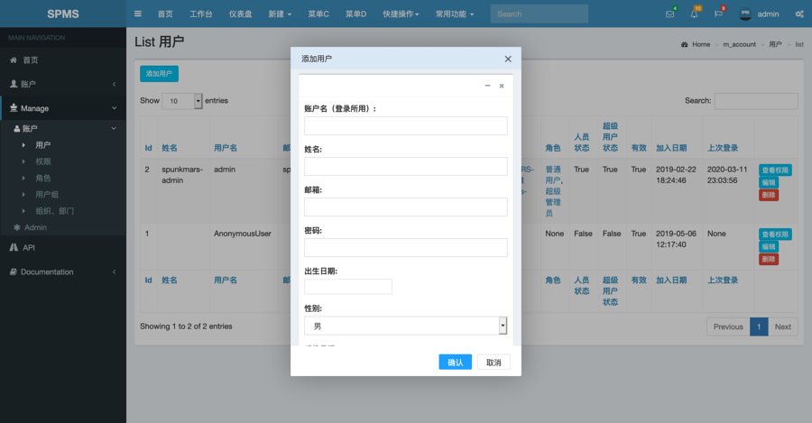

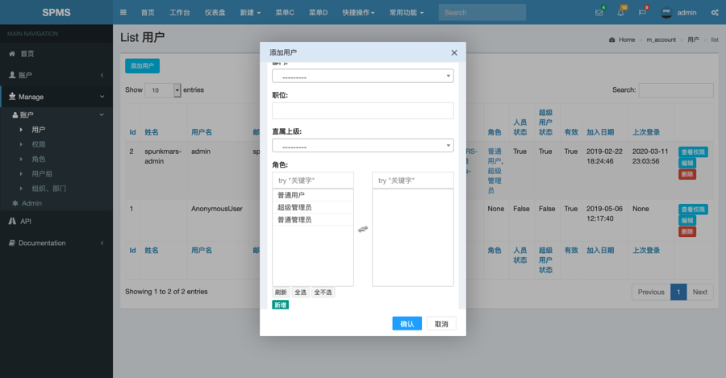

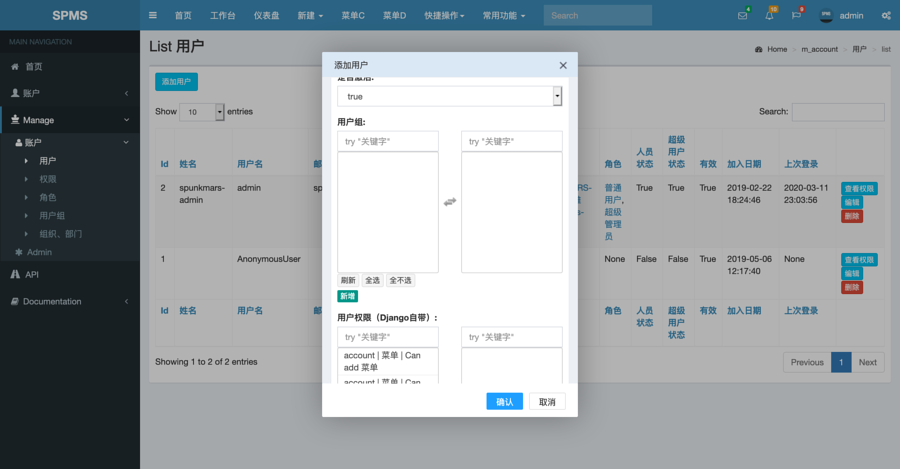

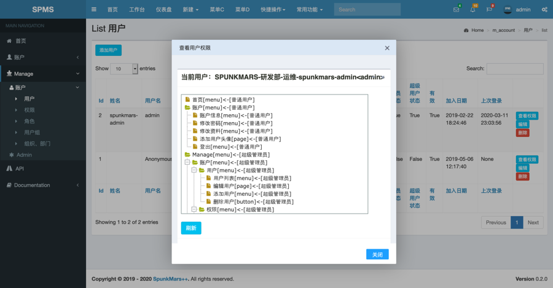

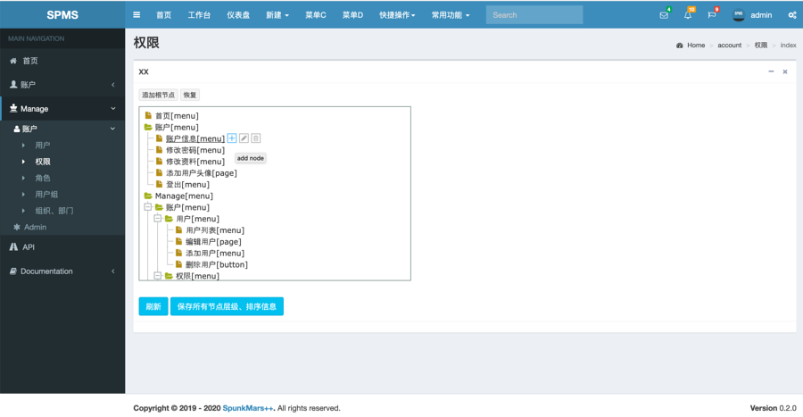

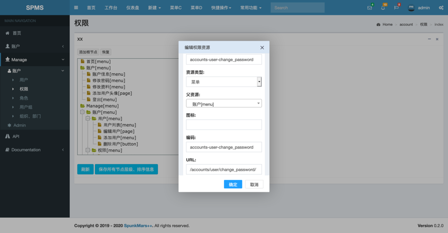

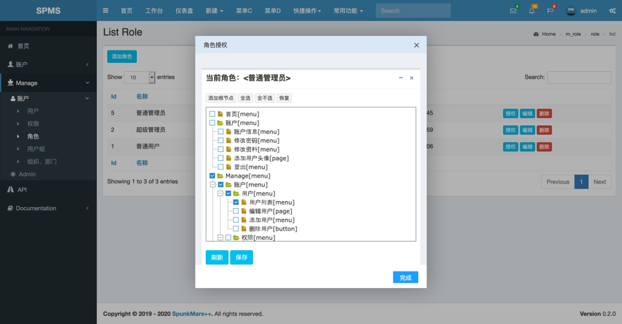

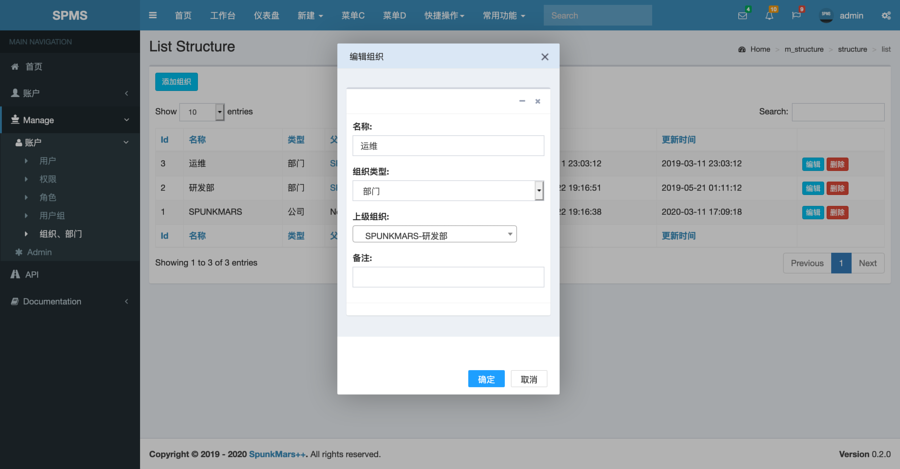

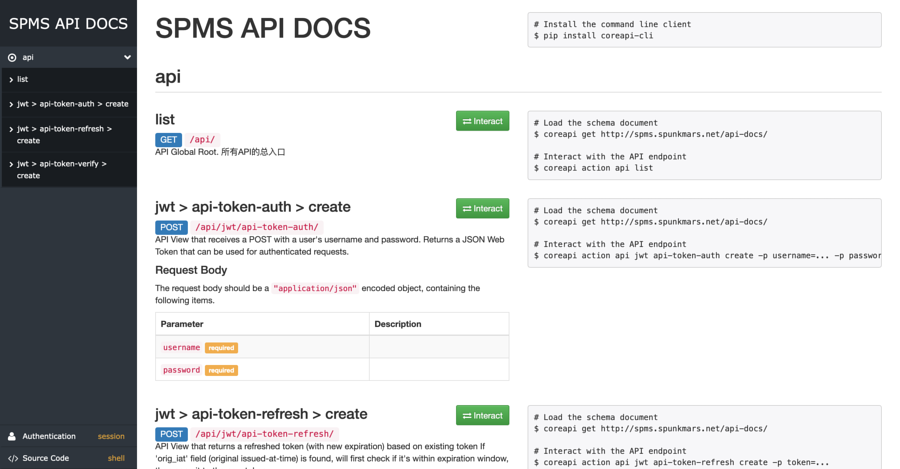

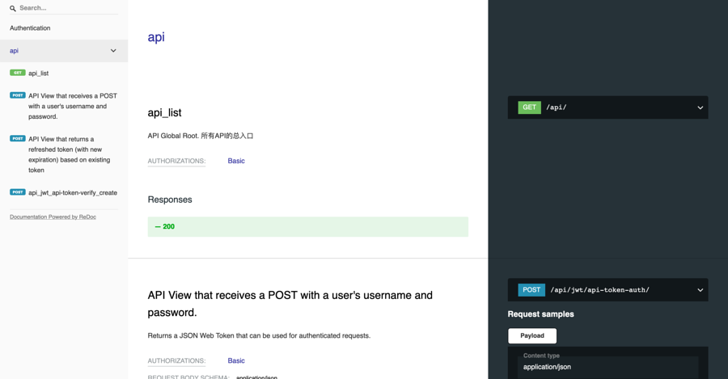

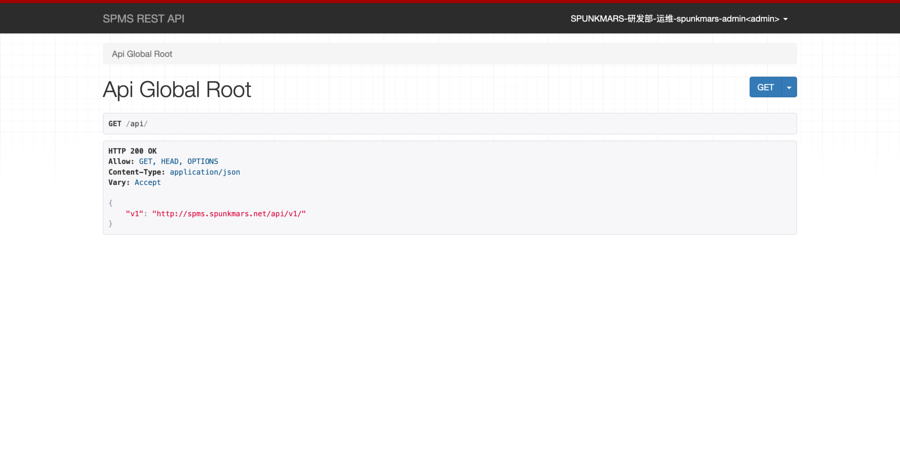

